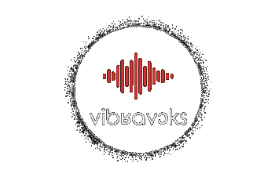

<div align="center">

<p align="center">
  
</p>

<a href="https://www.python.org/"></a>
<a href="https://pytorch.org"></a>
<a href="https://pytorchlightning.ai/"></a>
<a href="https://hydra.cc/"></a>
<a href="https://huggingface.co/datasets"></a>


Speech to Phoneme, Bandwidth Extension and Speaker Verification using the Vibravox dataset.


</div>

## Resources:

- **📝**: The paper related to this project is available on arXiv on [this link](https://arxiv.org/abs/2407.11828).
- **🤗**: The dataset used in this project is hosted by Hugging Face. You can access it [here](https://huggingface.co/datasets/Cnam-LMSSC/vibravox).  
- **🌐**: For more information about the project, visit our [project page](https://vibravox.cnam.fr/).
- **🏆**: Explore Leaderboards on [Papers With Code](https://paperswithcode.com/paper/vibravox-a-dataset-of-french-speech-captured).

## Requirements
```pip install -r requirements.txt```

## Run some models

- Train [EBEN](https://github.com/jhauret/eben) for Bandwidth Extension  
```
python run.py lightning_datamodule=bwe lightning_datamodule.sensor=throat_microphone lightning_module=eben  ++trainer.check_val_every_n_epoch=15 ++trainer.max_epochs=500
```

- Train [wav2vec2](https://huggingface.co/facebook/wav2vec2-base-fr-voxpopuli-v2) for Speech to Phoneme  
```
python run.py lightning_datamodule=stp lightning_datamodule.sensor=headset_microphone lightning_module=wav2vec2_for_stp lightning_module.optimizer.lr=1e-5 ++trainer.max_epochs=10
```

- Test [ECAPA2](https://huggingface.co/Jenthe/ECAPA2) for Speaker Verification
```
python run.py lightning_datamodule=spkv lightning_module=ecapa2 logging=csv ++trainer.limit_train_batches=0 ++trainer.limit_val_batches=0
```
